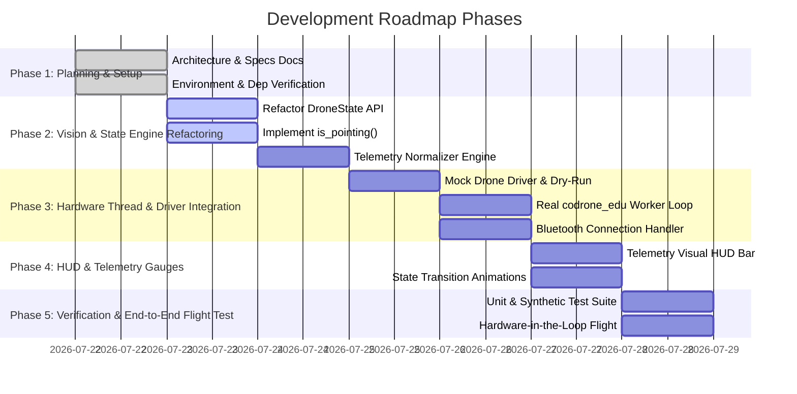

# Development Roadmap & Execution Plan (PLAN.md)

## 1. Project Objective

Build a production-ready, multithreaded Python application that controls a CoDrone Edu drone via real-time computer vision (MediaPipe) and hand gestures, featuring fail-safe state management, sub-second emergency response, and interactive HUD visual debugging.

---

## 2. Phased Development Roadmap

---

## 3. Phase Details & Deliverables

### Phase 1: Planning & Specification Alignment (Completed)
- [x] Create [SEED.md](file:///C:/Users/coden/Downloads/drone/SEED.md) context document.
- [x] Conduct evaluation of current codebase.
- [x] Establish `CommandCenter/` directory with `ARCHITECTURE.md`, `SPEC.md`, `PLAN.md`, and `TESTING.md`.

---

### Phase 2: Vision & State Machine Refactoring
* **Target Files:** `vision.py`, `state.py`, `gestures.py`
* **Tasks:**
  1. Refactor `DroneState` class:
     * Implement `get_flight_commands()` thread-safe getter.
     * Enforce input clamping (`[-100, 100]`) on `update_flight_commands()`.
  2. Implement strict `is_pointing(hand_landmarks)` gesture recognizer function according to [SPEC.md](file:///C:/Users/coden/Downloads/drone/CommandCenter/SPEC.md#L31-L32).
  3. Create `TelemetryMapper` class to compute `roll`, `pitch`, `yaw`, `throttle` with deadzones and scaling factors.
  4. Fix bug in [fly.py](file:///C:/Users/coden/Downloads/drone/fly.py) (`sleep` import issue) and clean up diagnostic files.

---

### Phase 3: Drone Hardware Worker Thread Integration
* **Target Files:** `drone_thread.py`, `main.py`
* **Tasks:**
  1. Build `DroneWorkerThread` running independently at 10-20 Hz.
  2. Implement `--mock-drone` dry-run mode for flight verification without physical drone hardware.
  3. Integrate `codrone_edu.drone.Drone` SDK with automatic Bluetooth pairing and error recovery.
  4. Connect `EMERGENCY_STOP` handler to execute `drone.emergency_stop()` within `< 100ms`.

---

### Phase 4: HUD & Visual Debugging Enhancements
* **Target Files:** `hud.py` / `vision.py`
* **Tasks:**
  1. Render live 4-axis telemetry gauges (`Roll`, `Pitch`, `Yaw`, `Throttle`) on OpenCV video feed.
  2. Display active gesture status, frame rate FPS counter, and crossed-arms countdown bar.

---

### Phase 5: Verification & System Hardening
* **Target Files:** `tests/`
* **Tasks:**
  1. Execute synthetic unit tests for state transitions and telemetry calculation.
  2. Perform Dry-Run simulation test with virtual state logging.
  3. Execute tethered live flight test with physical CoDrone Edu hardware following [TESTING.md](file:///C:/Users/coden/Downloads/drone/CommandCenter/TESTING.md) safety protocol.
